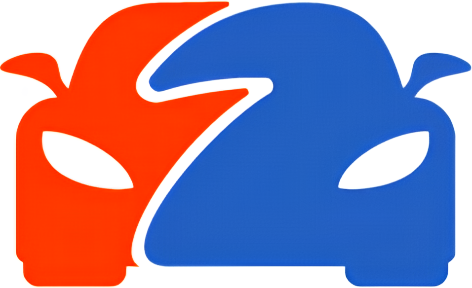

# P13: Your car your way WebSockets and WebRTC Proof of Concept (PoC)



### Description

This Proof of Concept (PoC) demonstrates the feasibility of real-time communication through an online chat and video-conference service, leveraging [WebSockets](https://developer.mozilla.org/en-US/docs/Web/API/WebSockets_API) and [WebRTC](https://webrtc.org/?hl=en) technologies.
The PoC aims to validate our proposal by showcasing a seamless exchange between users and customer service representatives, ensuring a robust and interactive user experience.

### Why WebSockets & WebRTC?

WebSockets enable persistent, bidirectional communication between the client and server, allowing for instant message delivery and low-latency interactions.
WebRTC facilitates peer-to-peer connections for audio, video, and data sharing, ensuring high-quality real-time communication without the need for intermediary servers.
By developing this PoC, we aim to reassure stakeholders of the viability and effectiveness of our proposed online chat functionality.

## Table of contents

- [P13: Your car your way WebSockets and WebRTC Proof of Concept (PoC)](#p13-your-car-your-way-websockets-and-webrtc-proof-of-concept-poc)
    - [Description](#description)
    - [Why WebSockets \& WebRTC?](#why-websockets--webrtc)
  - [Table of contents](#table-of-contents)
  - [Tech stack for the PoC](#tech-stack-for-the-poc)
    - [Front-End](#front-end)
    - [Back-End](#back-end)
  - [Pre-requisites](#pre-requisites)
    - [Node.js](#nodejs)
  - [Configuration](#configuration)
    - [Node.js](#nodejs-1)
  - [Installation procedure](#installation-procedure)
    - [Front-End](#front-end-1)
    - [Back-End](#back-end-1)
  - [Features and Limitations](#features-and-limitations)
    - [Features](#features)
    - [Limitations](#limitations)
  - [WebRTC glossary](#webrtc-glossary)
  - [WebRTC Peer-to-Peer Connection Setup](#webrtc-peer-to-peer-connection-setup)
    - [Get User Media (G.U.M.)](#get-user-media-gum)
    - [Create Peer Connection](#create-peer-connection)
    - [Add Local Tracks to the Connection](#add-local-tracks-to-the-connection)
    - [Add Event Listeners to Peer Connection](#add-event-listeners-to-peer-connection)
    - [ICE Candidate Event](#ice-candidate-event)
    - [ICE Candidate WebSocket Response](#ice-candidate-websocket-response)
    - [Sender (offerer)](#sender-offerer)
      - [User Wants to Initiate Call](#user-wants-to-initiate-call)
      - [Set Remote Description (Answer)](#set-remote-description-answer)
    - [Receiver (answerer)](#receiver-answerer)
      - [Set Remote Description (Offer)](#set-remote-description-offer)
      - [Create Answer and Set Local Description](#create-answer-and-set-local-description)
    - [On Track Event](#on-track-event)
    - [On Negotiation Needed Event](#on-negotiation-needed-event)
      - [Frontend (FE)](#frontend-fe)
      - [Backend (BE)](#backend-be)
        - [Initiating Peer](#initiating-peer)
        - [Receiving Peer](#receiving-peer)
  - [Miscellaneous](#miscellaneous)
    - [](#)
  - [Conclusion](#conclusion)

## Tech stack for the PoC

### Front-End

- HTML
- SASS
- TypeScript
- Angular 18

<a href="https://developer.mozilla.org/en-US/docs/Glossary/HTML5" target="_blank" rel="noreferrer" title="HTML5">
  
</a>
<a href="https://sass-lang.com/" target="_blank" rel="noreferrer" title="SASS">
  
</a>
<a href="https://www.typescriptlang.org/" target="_blank" rel="noreferrer" title="TypeScript">
  
</a>
<a href="https://angular.dev/" target="_blank" rel="noreferrer" title="Angular">
  
</a>

### Back-End

- Node.js 20.11.0
- ExpressJS 4.19.2 (only for HTTP requests)
- Socket.io 4.7.5

<a href="https://nodejs.org/en/" target="_blank" rel="noreferrer" title="NodeJS">
  
</a>
<a href="https://expressjs.com/" target="_blank" rel="noreferrer" title="ExpressJS">
  
</a>
<a href="https://socket.io/" target="_blank" rel="noreferrer" title="Socket.io">
  
</a>

## Pre-requisites

### Node.js

Install [Node.js LTS](https://nodejs.org/en) to install the Front-End dependencies.

## Configuration  

### Node.js

The project requires Node.js version 20.11.0

You can install Node.js also using the [node version manager (nvm)](https://github.com/coreybutler/nvm-windows), after clicking on the latest release and installing the  `nvm-setup.exe` file, you can upgrade or downgrade node version using the `nvm` commands

Here's the steps:

1. Check the list of node versions installed:

    ```shell
    nvm ls

    # Output example:
    # * 16.15.0 (Currently using 64-bit executable)
    ```

2. Install the node version to upgrade/downgrade to:

    ```shell
      nvm install 20.11.0
    ```

3. Use the freshly installed version:

    ```shell
      nvm ls
      # 20.11.0
      # * 16.13.1 (Currently using 64-bit executable)

      nvm use 20.11.0
      # Now using node v20.11.0 (64-bit)
    ```

**In case it doesn't work:**

Go to the `nodejs/` folder and slightly rename it, then re-execute `nvm use 20.11.0`

## Installation procedure

**Cloning the project:**
To clone this repository from GitHub, run the following command: `git clone https://github.com/LePhenix47/Lahouiti_Younes_P13_21062024 .`

### Front-End

1. Install the dependencies:

To start the Angular Front-End project, follow these steps:

- Navigate to the Front-End directory in your terminal:

```shell
cd front
```

- Install project dependencies using npm:

```shell
npm install
```

2. Starting the server

- After the dependencies are installed, you can start the development server by running:

```shell
npm run dev-https

# If you use Bun with `bun dev-https`, it will work just fine
```

This command will compile the Angular application and start a development server in HTTPS (WebRTC requires a secure context to function correctly).
You can then access the application in your browser at `https://localhost:4200`.

### Back-End

1. Install the dependencies and configure `.env` file:

To start the NodeJS Back-End project, follow these steps:

- Navigate to the Back-End directory in your terminal:

```shell
cd back
```

- Install project dependencies using npm:

```shell
npm install
```

- Once the dependencies installed you'll need to create a `.env` file, with contents similar to the [`.env.sample` file](./back/.env.example):

```env
# Any random address is accepted
LOCAL_IP=
```

2. Starting the server

- After the dependencies are installed, you can start the development server by running:

```shell
npm start

# If you use the Bun JS runtime you can also use `bun start`
```

This command will start the NodeJS development server.
You can then access the API with: `https://localhost:3000`.

## Features and Limitations

### Features

This PoC includes the following features:

- **Chat via WebSockets:** A real-time chat system built using WebSockets, allowing instant communication between users.

- **Video Conferencing with WebRTC:** Peer-to-peer video conferencing implemented using WebRTC, enabling direct audio and video communication.

- **Device Switching and Screen Sharing:** WebRTC-based functionality to switch between different input devices (e.g., cameras, microphones) and the ability to share your screen.

- **Screen Recording:** Ability to record your screen, with options to preview the current recording, view a list of all recordings, and access detailed information (duration and size) and download buttons for each recording

### Limitations

The PoC has some known limitations:

- **Lack of Loading Status and Connection Feedback:** There is no loading status displayed during local media switching or connection feedback during the WebRTC session, which may leave users uncertain about the connection status.

- **Potential Memory Leak During Screen Recording:** Starting a screen recording and then sharing the screen can cause a memory leak, potentially leading to performance issues.

- **Buggy Room Handling:** The room management system has bugs. For example, if two users are in a room and a third user creates and then deletes a new room, it can mistakenly delete all rooms. Additionally, the creator of a full room may be unable to create or delete their room afterward.

## WebRTC glossary

Understanding the key terms and components in WebRTC is crucial for working with this PoC:

<details>
  <summary>🗺️ <abbr title="Network Address Translation">NAT</abbr></summary>
  <dl>
    <dt>Network Address Translation (NAT):</dt>
    <dd>A method used to remap one IP address space into another.</dd>
  </dl>
</details>

<details>
  <summary>🔄 <abbr title="Session Traversal Utilities for NAT">STUN</abbr> / <abbr title="Traversal Using Relays around NAT">TURN</abbr></summary>
  <dl>
    <dt>Session Traversal Utilities for NAT (STUN) / Traversal Using Relays around NAT (TURN):</dt>
    <dd>STUN helps in discovering the correct IP address and port, while TURN relays media when direct peer-to-peer connection fails.</dd>
  </dl>
</details>

<details>
  <summary>🎥 Audio-video <abbr title="Peer-to-Peer">P2P</abbr></summary>
  <dl>
    <dt>Audio-video Peer-to-Peer (P2P):</dt>
    <dd>Direct peer-to-peer communication for audio and video streams.</dd>
  </dl>
</details>

<details>
  <summary>📡 <abbr title="User Datagram Protocol">UDP</abbr> and <abbr title="Transmission Control Protocol">TCP</abbr> streams</summary>
  <dl>
    <dt>User Datagram Protocol (UDP) and Transmission Control Protocol (TCP):</dt>
    <dd>Protocols for data transmission. UDP is preferred for real-time communication (audio and video), while TCP is used for reliable data transmission using text, such as with HTTP and WebSockets.</dd>
  </dl>
</details>

<details>
  <summary>🔗 Websockets</summary>
  <dl>
    <dt>Websockets:</dt>
    <dd>Protocol for two-way communication between a client and a server.</dd>
  </dl>
</details>

<details>
  <summary>📞 Signaling path</summary>
  <dl>
    <dt>Signaling Path:</dt>
    <dd>The process of establishing, maintaining, and terminating the connection between peers.</dd>
  </dl>
</details>

<details>
  <summary>📜 <abbr title="Session Description Protocol">SDP</abbr></summary>
  <dl>
    <dt>Session Description Protocol (SDP):</dt>
    <dd>A format for describing multimedia communication sessions.</dd>
  </dl>
</details>

<details>
  <summary>🖥️ Signaling server</summary>
  <dl>
    <dt>Signaling Server:</dt>
    <dd>A server that helps in establishing connections between peers by exchanging signaling messages (e.g., offers, answers, and ICE candidates), both HTTP and WebSockets can be used for signaling, but WebSockets are preferred.</dd>
  </dl>
</details>

## WebRTC Peer-to-Peer Connection Setup

This document outlines the process of setting up a peer-to-peer connection using WebRTC. The flow includes steps for both the sender and the receiver of the connection.

### Get User Media (G.U.M.)

Use `getUserMedia()` to access the user's camera and microphone, and `getDisplayMedia()` to access the user's screen.

```js
const ls1 = await navigator.mediaDevices.getUserMedia({ video: true, audio: true }); // User's webcam and microphone
const ls2 = await navigator.mediaDevices.getDisplayMedia({ video: true, audio: false  }); // User's screen
```

### Create Peer Connection

Create an `RTCPeerConnection` object.

```js
const pc = new RTCPeerConnection(turnOrStunConfig);
```

### Add Local Tracks to the Connection

Add local media tracks to the peer connection.

```js
ls1.getTracks().forEach(track => pc.addTrack(track));
ls2.getTracks().forEach(track => pc.addTrack(track));
```

### Add Event Listeners to Peer Connection

Listen for various events on the peer connection.

```js
pc.onicecandidate = (event) => { /* Handle ICE candidates */ };
pc.ontrack = (event) => { /* Handle remote track */ };
pc.onnegotiationneeded = (event) => { /* Handle negotiation */ };
pc.onsignalingstatechange = (event) => { /* Debug signaling state */ };
```

### ICE Candidate Event

When an ICE candidate is found, send it to the other peer via the signaling server.

```js
socket.emit("ice-candidate", event.candidate);
```

### ICE Candidate WebSocket Response

When receiving an ICE candidate from the signaling server, add it to the peer connection.

```js
socket.on("ice-candidate", (candidate) => pc.addIceCandidate(candidate));
```

### Sender (offerer)

#### User Wants to Initiate Call

Create an offer, set the local description, and send the offer via the signaling server.

```js
const offer = await pc.createOffer();
await pc.setLocalDescription(offer);
socket.emit("offer", offer);
```

#### Set Remote Description (Answer)

When receiving an answer, set the remote description.

```js
socket.on("answer", async (answer) => {
    await pc.setRemoteDescription(answer);
});
```

### Receiver (answerer)

#### Set Remote Description (Offer)

When receiving an offer, set the remote description.

```js
socket.on("offer", async (offer) => {
    await pc.setRemoteDescription(offer);
    const answer = await pc.createAnswer();
    await pc.setLocalDescription(answer);
    socket.emit("answer", answer);
});
```

#### Create Answer and Set Local Description

Create an answer, set the local description, and send the answer via the signaling server.

### On Track Event

When a remote media track is added, handle it by creating a new MediaStream and adding the track to it.

```js
pc.ontrack = (event) => {
    const remoteStream = new MediaStream();
    event.streams[0].getTracks().forEach(track => remoteStream.addTrack(track));
    remoteVideoElement.srcObject = remoteStream;
};
```

### On Negotiation Needed Event

When negotiation is needed, handle it appropriately (e.g., create and send a new offer if necessary).

#### Frontend (FE)

- `offer`: Emitted when the initiating peer creates an offer.
- `ice-candidate`: Emitted when an ICE candidate is generated.
- `answer`: Emitted when the receiving peer creates an answer.

#### Backend (BE)

- `offer`: Broadcasts the SDP offer from the initiating peer to the receiving peer.
- `ice-candidate`: Broadcasts the ICE candidates between peers.
- `answer`: Broadcasts the SDP answer from the receiving peer to the initiating peer.

##### Initiating Peer

**Outgoing Events:**

1. **Send SDP offer:**

   ```js
   socket.emit('offer', {
     type: 'offer',
     sdp: peerConnection.localDescription
   });
   ```

2. **Send ICE candidates:**

   ```js
   peerConnection.onicecandidate = (event) => {
     if (event.candidate) {
       socket.emit('ice-candidate', {
         candidate: event.candidate
       });
     }
   };
   ```

**Incoming Events:**

1. **Receive SDP answer:**

   ```js
   socket.on('answer', async (message) => {
     await peerConnection.setRemoteDescription(new RTCSessionDescription(message));
   });
   ```

2. **Receive ICE candidates:**

   ```js
   socket.on('ice-candidate', async (message) => {
     try {
       await peerConnection.addIceCandidate(new RTCIceCandidate(message.candidate));
     } catch (e) {
       console.error('Error adding received ice candidate', e);
     }
   });
   ```

##### Receiving Peer

**Outgoing Events:**

1. **Send SDP answer:**

   ```js
   socket.emit('answer', {
     type: 'answer',
     sdp: peerConnection.localDescription
   });
   ```

2. **Send ICE candidates:**

   ```js
   peerConnection.onicecandidate = (event) => {
     if (event.candidate) {
       socket.emit('ice-candidate', {
         candidate: event.candidate
       });
     }
   };
   ```

**Incoming Events:**

1. **Receive SDP offer:**

   ```js
   socket.on('offer', async (message) => {
     await peerConnection.setRemoteDescription(new RTCSessionDescription(message));
     const answer = await peerConnection.createAnswer();

     // Emit the answer, see "Send SDP answer"
   });
   ```

2. **Receive ICE candidates:**

   ```js
   socket.on('ice-candidate', async (message) => {
     try {
       await peerConnection.addIceCandidate(new RTCIceCandidate(message.candidate));
     } catch (e) {
       console.error('Error adding received ice candidate', e);
     }
   });
   ```

## Miscellaneous

<details>
  <summary>💻 WebRTC flow chart</summary>


[View discussion here](https://github.com/LePhenix47/Lahouiti_Younes_P13_21062024/discussions/12)
</details>

<details>
  <summary>🛠️ Back-End Stack Explanation</summary>

###

<strong>Why Node.js was chosen for the Back-End instead of Java with Spring Boot</strong>

1. **Outdated and Complex Libraries**: Using Spring Boot's WebSocket dependencies through Spring Initializer would require [StompJS](https://github.com/stomp-js/stompjs) and [SockJS](https://github.com/sockjs/sockjs-client). While the lack of updates since 2021 makes these libraries difficult to work with on the Back-End, the real annoyance lies in the Front-End. Integrating these libraries on the Front-End is complex and cumbersome. Additionally, this stack does not support sending binary data, and its features are limited compared to modern libraries like [Socket.io](https://github.com/socketio/socket.io).

2. **Socket.io with Spring Boot**: While there is a [Socket.io](https://github.com/socketio/socket.io) implementation for Spring Boot ([Netty-Socket.io](https://github.com/mrniko/netty-socketio)), it comes with a major drawback: the library has had no documentation at all, and that since 2012. This forces reliance on third-party articles and YouTube tutorials, which often lead to configuration issues. Despite attempting to configure it myself, I encountered persistent problems.

Given these challenges, Node.js was chosen for WebSocket implementation due to its robust ecosystem and active support.

</details>

## Conclusion

This Proof of Concept (PoC) for "Your Car Your Way" successfully demonstrates the capabilities of WebSockets and WebRTC for real-time communication in an online chat and video-conference environment. Through the seamless integration of these technologies, we've showcased the potential to deliver an interactive, high-quality user experience that meets the expectations of modern digital communication.

The PoC validates the feasibility of implementing such technologies in a production environment, offering insights into both the advantages and challenges encountered during development. While the PoC highlights the robustness of WebSockets for instant messaging and WebRTC for video conferencing, it also sheds light on areas that require further refinement, such as connection feedback, memory management, and room handling.

By using Node.js for the Back-End and Angular for the Front-End, we were able to create a responsive and scalable architecture that aligns with current industry standards. The choice of these technologies also provided flexibility and ease of development, making this PoC not only a demonstration of the proposed solution but also a foundation for future enhancements.

In conclusion, this PoC serves as a strong foundation for the next stages of development, offering stakeholders a clear vision of the technical viability and user experience that can be expected in the final implementation. With further iteration and optimization, this approach has the potential to revolutionize how customers and service representatives interact in real-time, delivering a more personalized and efficient service experience.
